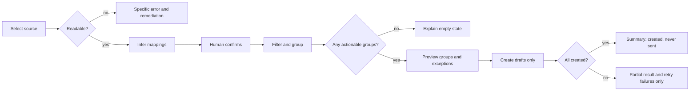

# Product wireframes

## Why these states

Mapping and exception handling determine trust before any draft is created. These wireframes are **proposals**, not shipped UI. The current verified surfaces are a skill workflow and CLI payload builder (`SKILL.md`, `scripts/build_draft_payloads.py`).

## 1. Source and mapping

```text
+ Action Item Email Drafter ---------------------------------------+
| 1 Source  >  2 Map  >  3 Review  >  4 Create drafts             |
| Source: review-actions.xlsx      Sheet: [Outstanding v]          |
| Detected 184 rows | 23 possible recipients                       |
|                                                                  |
| Map columns                                                      |
| Recipient *  [Owner____________v]  Confidence: high               |
| Display name [Owner Name_______v]                                 |
| Status       [State____________v]  Include: [Open-like only v]    |
| Item fields  [Service] [Action] [Due Date] [Link]                 |
|                                                                  |
| [Back]                         [Preview grouping ->]               |
+------------------------------------------------------------------+
Annotation: inferred values are editable and never become approved silently.
```

**Edge:** duplicate headers show field positions, not a guessed selection.
**Error:** an unsupported file or missing XLSX dependency presents the remediation exposed by `read_rows`.
**Loading:** retain filename and show “Reading rows…” with cancel; do not display row contents in global logs.

## 2. Review and happy path

```text
+ Review ----------------------------------------------------------+
| Ready: 22 drafts / 176 rows       Exceptions: 8 rows             |
| [Recipients] [Sample draft] [Exceptions (8)]                     |
| > owner-a       4 items    mapped                                 |
|   owner-b      12 items    mapped                                 |
|   owner-c       1 item     address needs review                   |
|                                                                  |
| Sample: owner-a                                                |
| Subject: [Action Required] Outstanding items - 4 pending          |
| Hi Owner,                                                       |
| [Service | Action | Status | Due Date]                            |
| ...source-derived escaped cells...                                |
|                                                                  |
| [< Back to mapping]                  [Create 22 drafts]            |
|                                      Nothing will be sent.         |
+------------------------------------------------------------------+
```

Annotation: selection defaults to the sample only; draft count excludes unresolved groups.

## 3. Empty and filtered-empty states

```text
+ Nothing actionable ---------------------------------------------+
| 0 drafts | 0 included rows | 184 rows evaluated                  |
| No rows matched the current open-status rule.                    |
| [Review status values] [Include all rows] [Choose another sheet] |
+------------------------------------------------------------------+
```

Distinguish “file has no rows,” “all rows closed,” and “all rows missing recipients.” They imply different fixes.

## 4. Creation progress, error, and partial success

```text
+ Creating mailbox drafts ----------------------------------------+
| Progress  [############--------] 14 / 22                          |
| Created: 14  Failed: 1  Pending: 7                               |
| ! owner-c — recipient could not be resolved                      |
|                                                                  |
| [Stop after current draft]                                       |
+------------------------------------------------------------------+

+ Completed with exceptions --------------------------------------+
| 21 drafts created. 0 messages sent.                              |
| 1 draft failed and remains unresolved.                           |
| [Retry failed only] [Open Drafts] [Export safe summary]          |
+------------------------------------------------------------------+
```

Do not retry successful groups automatically; that could create duplicates.

## 5. Oversized group edge state

```text
+ Review large draft ---------------------------------------------+
| owner-d has 87 items; the default table may be hard to use.      |
| ( ) Keep one draft  ( ) Split into chunks of [20]  ( ) Exclude   |
| Preview pages: 1 2 3 4 5                                        |
+------------------------------------------------------------------+
```

Splitting is a roadmap hypothesis, not current behavior.

## Proposed flow



## Accessibility and responsive notes

- Use semantic labels, table headers, and text status; never rely on color alone.
- Focus moves to the first validation error and returns to the invoking control when a dialog closes.
- Every drag/drop-like mapping interaction needs select controls and keyboard equivalents.
- Announce progress and partial failures through a polite live region; avoid per-row chatter.
- At narrow widths, stack mapping fields and replace the recipient/sample split with tabs.
- Tables scroll horizontally without trapping keyboard focus; provide a card view for small screens.
- Keep “Nothing will be sent” adjacent to the primary create-drafts action.
